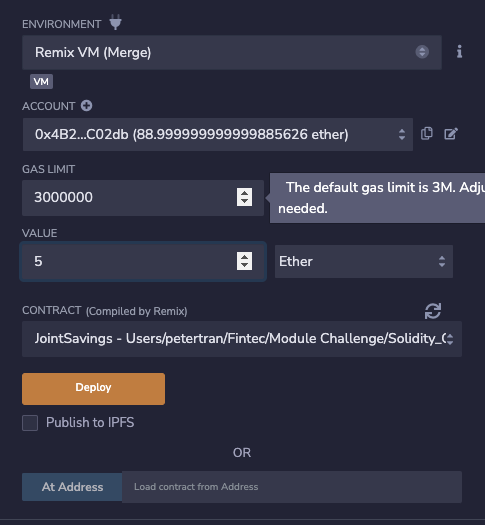

# Unit 20 - "Joint Savings Account"

## Background

This is a Solidity smart contract that implements a joint savings account. The smart contract accepts two user addresses that are then able to control the account. It uses ether management functions to implement various requirements from the financial institution to provide the features of the joint savings account.

## Navigation

The JointSavings smart contract has four variables:

- **Execution_Results** Directory containing screenshts of contract executions
- **joint_savings.sol** Solidity file that contains smart contract

### Requirements

 - Remix - Ethereum IDE
    - solidity ^0.5.0

## Deployment

### Set accounts

### Transaction 1

Deposit 1 Ether as Wei

 

### Transaction 2

Deposit 10 Ether as Wei

 

### Transaction 3

Deposit 5 Ether

 

### Withdrawal 1

Withdraw 5 Ether into AccountOne

### Withdrawl 2

Withdraw 10 Ether into AccountTwo

